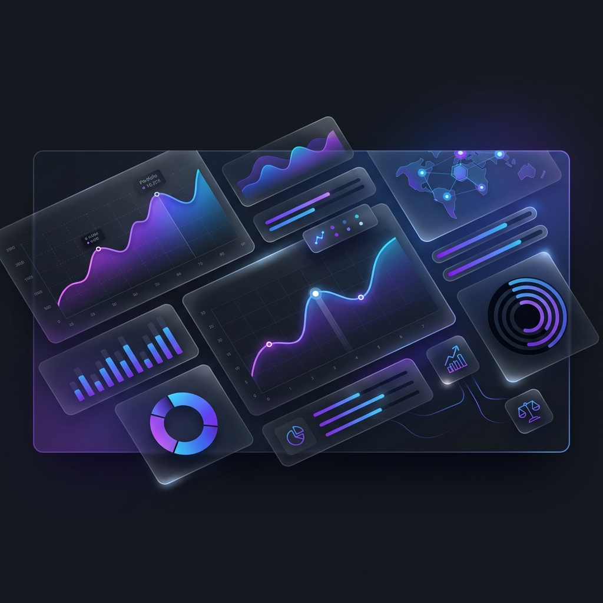

# 💎 FinTrack V2: The Ultimate Wealth Control Center



[](https://nextjs.org/)
[](https://nestjs.com/)
[](https://tailwindcss.com/)
[](https://www.prisma.io/)
[](https://www.postgresql.org/)
[](https://www.typescriptlang.org/)

**FinTrack V2** is a professional-grade, high-performance wealth management application designed to evolve from simple expense tracking into a comprehensive financial command center. Built with a focus on **privacy**, **precision**, and **premium aesthetics**, it provides users with deep insights into their net worth, market investments, and long-term financial health.

---

## ✨ Key Features

### 📊 Wealth Intelligence
- **Universal Net Worth Dashboard**: A unified view of liquid assets, market investments (Stocks/Crypto), and outstanding liabilities.
- **Real-Time Valuations**: Automated background workers fetch live market prices to keep your investment portfolio up-to-date.
- **Historical Snapshots**: Periodic snapshots of your financial state, enabling beautiful trend analysis and growth tracking.

### 🎨 Elite User Experience
- **Glassmorphism UI**: A stunning, modern interface built with Next.js 16 and Tailwind CSS v4.
- **Fluid Animations**: High-performance micro-interactions powered by Framer Motion.
- **Privacy-First Design**: One-click "Privacy Mode" to mask sensitive wealth totals while still managing your data.
- **Interactive Heatmaps**: Visualize liability interest rates and debt distribution with intuitive heatmaps.

### 🛡️ Robust Architecture
- **Unified Logic**: Modular NestJS backend with standardized API responses and Zod-based validation.
- **Enterprise Security**: Secure JWT authentication and protected API routes.
- **Precision Accounting**: Financial data stored in integer cents to eliminate floating-point rounding errors.

---

## 🏗️ Technology Stack

| Layer | Technologies |
| :--- | :--- |
| **Frontend** | Next.js 16 (App Router), React 19, Tailwind CSS 4, Framer Motion, Zustand, TanStack Query |
| **Backend** | NestJS 11, TypeScript, RxJS, Fastify/Express |
| **Database** | PostgreSQL, Prisma ORM 7.5 |
| **Infrastructure** | Background Cron Workers (Schedule), JWT Auth, Zod Validation, Swagger (OpenAPI) |

---

## 🚀 Getting Started

### Prerequisites
- **Node.js**: v20 or later
- **PostgreSQL**: v14 or later
- **npm / pnpm / yarn**

### Repository Structure
```bash
FinTrack/
├── client/          # Next.js Frontend
└── server/backend/  # NestJS API & Workers
```

### Installation & Setup

1. **Clone the repository:**
   ```bash
   git clone https://github.com/your-username/FinTrack.git
   cd FinTrack
   ```

2. **Backend Setup:**
   ```bash
   cd server/backend
   npm install
   # Create .env and configure DATABASE_URL
   npx prisma generate
   npx prisma migrate dev
   npm run start:dev
   ```

3. **Frontend Setup:**
   ```bash
   cd ../../client
   npm install
   # Configure environment variables
   npm run dev
   ```

4. **Access the application:**
   - Frontend: `http://localhost:3000`
   - API Documentation (Swagger): `http://localhost:4000/api` (default port)

---

## 🛠️ Development

- **Linting**: `npm run lint`
- **Testing**: `npm run test` (Backend)
- **Formatting**: `npm run format` (Backend)

---

## 📄 License
This project is [UNLICENSED](LICENSE). (Modify as needed)

---

<p align="center">Made with ❤️ for Financial Freedom</p>
