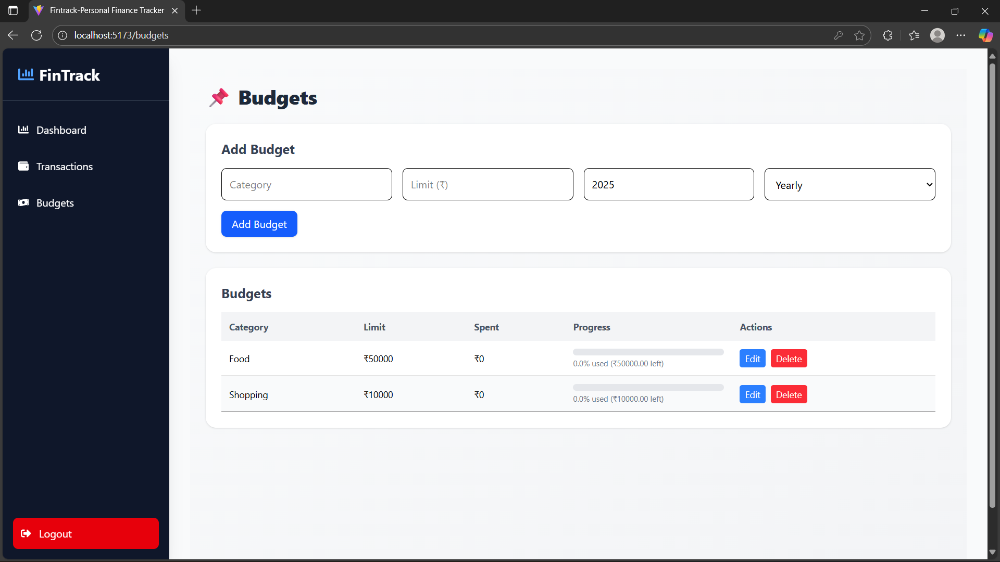

# 💰 FinTrack – Personal Finance Tracker with AI Assistance

<p align="center">
  
</p>

<p align="center">
  <strong>A full-stack personal finance management application</strong><br>
  Track income, expenses, budgets, and savings with interactive dashboards, charts, and AI-powered insights.
</p>

<p align="center">
  
  
  
  
  
</p>

<p align="center">
  <a href="#-features">Features</a> •
  <a href="#-tech-stack">Tech Stack</a> •
  <a href="#-getting-started">Getting Started</a> •
  <a href="#-api-documentation">API Docs</a> •
  <a href="#-contributing">Contributing</a>
</p>

---

## 🌟 Highlights

- 🔐 **Secure Authentication** with JWT and HTTP-only cookies
- 📊 **Real-time Dashboard** with interactive charts and analytics
- 💸 **Transaction Management** with categories and payment methods
- 🎯 **Budget Tracking** with progress bars and alerts
- 📈 **Financial Insights** with AI-powered recommendations
- 🎨 **Modern UI/UX** with responsive design and smooth animations
- 🌙 **Dark Mode** support (coming soon)
- 📱 **Mobile Responsive** works seamlessly on all devices

---

## ✨ Features

### 🔐 Authentication & Security
- ✅ Secure JWT-based authentication
- ✅ Password hashing with bcrypt
- ✅ HTTP-only cookie management
- ✅ Protected routes and middleware
- ✅ Session management
- ✅ Password strength validation

### 💰 Transaction Management
- ✅ Add, edit, delete, and view transactions
- ✅ Categorize by type (income/expense)
- ✅ Multiple payment methods (cash, card, UPI, bank transfer)
- ✅ Date-based filtering and search
- ✅ Bulk import from CSV/Excel
- ✅ Transaction notes and attachments
- ✅ Recurring transaction support

### 🎯 Budget & Goals
- ✅ Set monthly/yearly spending limits by category
- ✅ Budget progress tracking with visual indicators
- ✅ Overspending alerts and notifications
- ✅ Goal setting and milestone tracking
- ✅ Budget templates
- ✅ Category-wise budget analysis

### 📊 Dashboard & Analytics
- ✅ Interactive financial overview
- ✅ Income vs Expense comparison
- ✅ Savings rate calculation
- ✅ Monthly/yearly trends
- ✅ Category-wise breakdown
- ✅ Balance trend charts
- ✅ Last 7 days comparison
- ✅ Custom date range reports

### 🤖 AI-Powered Features (Coming Soon)
- 🚧 Spending pattern analysis
- 🚧 Budget recommendations
- 🚧 Anomaly detection
- 🚧 Cashflow predictions
- 🚧 Personalized savings tips
- 🚧 Smart categorization

### 🎨 User Experience
- ✅ Beautiful, modern UI with Tailwind CSS
- ✅ Smooth animations with Framer Motion
- ✅ Responsive design for all devices
- ✅ Interactive charts with Chart.js
- ✅ Toast notifications
- ✅ Loading states and error handling
- ✅ Intuitive navigation

---

## 🛠️ Tech Stack

### Frontend
| Technology | Description |
|------------|-------------|
| ⚛️ **React 18** | Modern UI library with hooks |
| ⚡ **Vite** | Next-generation frontend tooling |
| 🎨 **Tailwind CSS** | Utility-first CSS framework |
| 📊 **Chart.js** | Interactive charts and graphs |
| 🎭 **Framer Motion** | Production-ready animations |
| 🧭 **React Router v6** | Declarative routing |
| 📡 **Axios** | Promise-based HTTP client |

### Backend
| Technology | Description |
|------------|-------------|
| 🚀 **Node.js** | JavaScript runtime |
| ⚡ **Express.js** | Fast, minimal web framework |
| 🗄️ **MongoDB** | NoSQL database |
| 🔧 **Mongoose** | Elegant MongoDB object modeling |
| 🔑 **JWT** | JSON Web Token authentication |
| 🔐 **bcryptjs** | Password hashing |
| 🍪 **cookie-parser** | Cookie parsing middleware |
| ✅ **express-validator** | Input validation |

### Development Tools
| Tool | Purpose |
|------|---------|
| 📦 **npm** | Package management |
| 🔄 **nodemon** | Auto-restart dev server |
| 🎯 **ESLint** | Code linting |
| 🔍 **Prettier** | Code formatting |
| 🐛 **Thunder Client** | API testing |

---

## 📂 Project Structure

```
fintrack/
│
├── server/                      # Backend (Node.js + Express)
│   ├── config/
│   │   └── db.js               # MongoDB connection
│   ├── controllers/
│   │   ├── authController.js   # Authentication logic
│   │   ├── transactionController.js
│   │   └── budgetController.js
│   ├── middleware/
│   │   ├── authMiddleware.js   # JWT verification
│   │   └── errorHandler.js     # Error handling
│   ├── models/
│   │   ├── User.js             # User schema
│   │   ├── Transaction.js      # Transaction schema
│   │   └── Budget.js           # Budget schema
│   ├── routes/
│   │   ├── authRoutes.js       # /api/auth
│   │   ├── transactionRoutes.js # /api/transactions
│   │   └── budgetRoutes.js     # /api/budgets
│   ├── utils/
│   │   ├── validators.js       # Input validation
│   │   └── helpers.js          # Helper functions
│   ├── .env                    # Environment variables
│   ├── package.json
│   └── index.js                # Entry point
│
├── fintrack-client/             # Frontend (React + Vite)
│   ├── public/
│   │   └── assets/             # Static assets
│   ├── src/
│   │   ├── components/
│   │   │   ├── Layout.jsx      # Main layout wrapper
│   │   │   ├── Sidebar.jsx     # Navigation sidebar
│   │   │   ├── Navbar.jsx      # Top navigation
│   │   │   ├── BudgetForm.jsx
│   │   │   ├── BudgetTable.jsx
│   │   │   └── DashboardCharts.jsx
│   │   ├── pages/
│   │   │   ├── HomePage.jsx    # Landing page
│   │   │   ├── Login.jsx       # Login page
│   │   │   ├── Register.jsx    # Registration page
│   │   │   ├── Dashboard.jsx   # Main dashboard
│   │   │   ├── Transactions.jsx
│   │   │   └── Budgets.jsx
│   │   ├── utils/
│   │   │   ├── categories.js   # Transaction categories
│   │   │   └── api.js          # API utilities
│   │   ├── App.jsx             # Main app component
│   │   ├── main.jsx            # Entry point
│   │   └── index.css           # Global styles
│   ├── .env                    # Environment variables
│   ├── tailwind.config.js      # Tailwind configuration
│   ├── vite.config.js          # Vite configuration
│   └── package.json
│
├── assets/                      # Documentation assets
│   ├── diagram.png
│   ├── login.png
│   ├── dashboard.png
│   └── transactions.png
│
├── .gitignore
├── LICENSE
└── README.md
```

---

## 🏗️ Architecture 
   <p align="center">
  
  </p>

### System Architecture
```
┌─────────────┐         ┌─────────────┐         ┌─────────────┐
│   Client    │ ──HTTP──│   Express   │ ─Mongoose─│  MongoDB   │
│  (React)    │   API   │   Server    │           │  Database  │
└─────────────┘         └─────────────┘         └─────────────┘
      │                        │
      │                        │
      ▼                        ▼
  JWT Token              Protected Routes
  Cookies                Middleware
```

### Database Schema

**Users Collection:**
```javascript
{
  _id: ObjectId,
  name: String,
  email: String (unique),
  password: String (hashed),
  createdAt: Date
}
```

**Transactions Collection:**
```javascript
{
  _id: ObjectId,
  userId: ObjectId (ref: User),
  type: String (income/expense),
  amount: Number,
  category: String,
  paymentMethod: String,
  date: Date,
  notes: String,
  createdAt: Date
}
```

**Budgets Collection:**
```javascript
{
  _id: ObjectId,
  userId: ObjectId (ref: User),
  category: String,
  limit: Number,
  type: String (monthly/yearly),
  year: Number,
  month: Number (optional),
  createdAt: Date
}
```

---

## 🚀 Getting Started

### Prerequisites

Before you begin, ensure you have the following installed:
- **Node.js** (v16 or higher) - [Download](https://nodejs.org/)
- **MongoDB** (v5 or higher) - [Download](https://www.mongodb.com/try/download/community)
- **npm** or **yarn** - Comes with Node.js
- **Git** - [Download](https://git-scm.com/)

### Installation

#### 1️⃣ Clone the Repository
```bash
git clone https://github.com/Satwik290/fintrack.git
cd fintrack
```

#### 2️⃣ Backend Setup
```bash
cd server
npm install
```

Create a `.env` file in the `server` directory:
```env
# Server Configuration
PORT=5000
NODE_ENV=development

# Database
MONGO_URI=mongodb://localhost:27017/fintrack
# Or use MongoDB Atlas:
# MONGO_URI=mongodb+srv://<username>:<password>@cluster.mongodb.net/fintrack

# JWT Configuration
JWT_SECRET=your_super_secret_jwt_key_here_min_32_characters
JWT_EXPIRE=7d

# Frontend URL (for CORS)
CLIENT_URL=http://localhost:5173

# Optional: Email Configuration (for notifications)
EMAIL_HOST=smtp.gmail.com
EMAIL_PORT=587
EMAIL_USER=your-email@gmail.com
EMAIL_PASS=your-app-password
```

Start the backend server:
```bash
npm run dev
```

Server will run on `http://localhost:5000`

#### 3️⃣ Frontend Setup
```bash
cd fintrack-client
npm install
```

Create a `.env` file in the `fintrack-client` directory:
```env
VITE_API_URL=http://localhost:5000
```

Start the frontend development server:
```bash
npm run dev
```

Frontend will run on `http://localhost:5173`

#### 4️⃣ Access the Application

Open your browser and navigate to:
- **Frontend:** http://localhost:5173
- **Backend API:** http://localhost:5000/api

---

## 📡 API Documentation

### Base URL
```
http://localhost:5000/api
```

### Authentication Endpoints

#### Register User
```http
POST /auth/register
Content-Type: application/json

{
  "name": "John Doe",
  "email": "john@example.com",
  "password": "password123"
}

Response: 201 Created
{
  "message": "User registered successfully",
  "user": { "id": "...", "name": "...", "email": "..." }
}
```

#### Login User
```http
POST /auth/login
Content-Type: application/json

{
  "email": "john@example.com",
  "password": "password123"
}

Response: 200 OK
{
  "message": "Login successful",
  "token": "jwt_token_here",
  "user": { "id": "...", "name": "...", "email": "..." }
}
```

### Transaction Endpoints (Protected)

#### Get All Transactions
```http
GET /transactions
Authorization: Bearer <token>

Response: 200 OK
[
  {
    "_id": "...",
    "type": "expense",
    "amount": 500,
    "category": "food",
    "date": "2024-01-15",
    "paymentMethod": "card"
  }
]
```

#### Create Transaction
```http
POST /transactions
Authorization: Bearer <token>
Content-Type: application/json

{
  "type": "expense",
  "amount": 500,
  "category": "food",
  "date": "2024-01-15",
  "paymentMethod": "card",
  "notes": "Dinner at restaurant"
}

Response: 201 Created
```

#### Get Summary
```http
GET /transactions/summary
Authorization: Bearer <token>

Response: 200 OK
{
  "income": 50000,
  "expense": 30000,
  "savings": 20000
}
```

### Budget Endpoints (Protected)

#### Create Budget
```http
POST /budgets
Authorization: Bearer <token>
Content-Type: application/json

{
  "category": "food",
  "limit": 5000,
  "type": "monthly",
  "year": 2024,
  "month": 1
}
```

#### Get Budget Utilization
```http
GET /budgets/utilization?year=2024&month=1
Authorization: Bearer <token>

Response: 200 OK
[
  {
    "category": "food",
    "limit": 5000,
    "spent": 3500,
    "remaining": 1500,
    "percentage": 70
  }
]
```

---

## 📸 Screenshots

### Landing Page
<p align="center">
  
</p>

### Registration
<p align="center">
  
</p>

### Login
<p align="center">
  
</p>

### Dashboard
<p align="center">
  
</p>

### Transactions
<p align="center">
  
</p>

### Budgets
<p align="center">
  
</p>

---

## 🧪 Testing

### Running Tests
```bash
# Backend tests
cd server
npm test

# Frontend tests
cd fintrack-client
npm test
```

### API Testing with Thunder Client
Import the `thunder-tests` collection from the project root.

---

## 📦 Deployment

### Deploy Backend (Railway/Render)

1. Create account on [Railway](https://railway.app) or [Render](https://render.com)
2. Create new project from GitHub
3. Add environment variables
4. Deploy

### Deploy Frontend (Vercel/Netlify)

```bash
# Build for production
cd fintrack-client
npm run build

# Deploy to Vercel
npm i -g vercel
vercel

# Or deploy to Netlify
npm i -g netlify-cli
netlify deploy --prod
```

### Environment Variables for Production
Update your `.env` files with production URLs:
```env
# Frontend
VITE_API_URL=https://your-api.railway.app

# Backend
CLIENT_URL=https://your-app.vercel.app
```

---

## 📅 Roadmap

### 🚧 Upcoming Features

#### Phase 1 (Q1 2025)
- [x] Basic authentication
- [x] Transaction management
- [x] Budget tracking
- [x] Dashboard with charts
- [ ] Dark mode toggle
- [ ] Email notifications

#### Phase 2 (Q2 2025)
- [ ] AI-powered insights using Gemini API
- [ ] Spending pattern analysis
- [ ] Budget recommendations
- [ ] Cashflow predictions
- [ ] Recurring transactions
- [ ] Bill reminders

#### Phase 3 (Q3 2025)
- [ ] Mobile app (React Native)
- [ ] Bank account integration
- [ ] Investment tracking
- [ ] Tax calculation tools
- [ ] Multi-currency support
- [ ] Export to PDF/Excel

#### Phase 4 (Q4 2025)
- [ ] Collaborative budgets
- [ ] Family account sharing
- [ ] Advanced analytics
- [ ] Goal tracking with milestones
- [ ] Receipt scanning (OCR)
- [ ] Voice commands

---

## 🤝 Contributing

We welcome contributions from the community! Here's how you can help:

### How to Contribute

1. **Fork the repository** 🍴
   ```bash
   # Click the "Fork" button on GitHub
   ```

2. **Clone your fork** 📥
   ```bash
   git clone https://github.com/YOUR_USERNAME/fintrack.git
   cd fintrack
   ```

3. **Create a feature branch** 🌱
   ```bash
   git checkout -b feature/amazing-feature
   ```

4. **Make your changes** ✨
   - Write clean, readable code
   - Follow existing code style
   - Add comments where necessary
   - Test your changes thoroughly

5. **Commit your changes** 💾
   ```bash
   git add .
   git commit -m "Add: amazing new feature"
   ```

6. **Push to your fork** 🚀
   ```bash
   git push origin feature/amazing-feature
   ```

7. **Open a Pull Request** 📬
   - Go to the original repository
   - Click "New Pull Request"
   - Describe your changes
   - Wait for review

### Contribution Guidelines

- **Code Style:** Follow JavaScript Standard Style
- **Commits:** Use conventional commit messages
  - `feat:` for new features
  - `fix:` for bug fixes
  - `docs:` for documentation
  - `style:` for formatting
  - `refactor:` for code refactoring
- **Testing:** Add tests for new features
- **Documentation:** Update README if needed

### Areas for Contribution

- 🐛 Bug fixes
- ✨ New features
- 📝 Documentation improvements
- 🎨 UI/UX enhancements
- 🧪 Test coverage
- 🌍 Translations
- ♿ Accessibility improvements

---

## 🐛 Known Issues

- [ ] Chart responsiveness on very small screens
- [ ] Safari cookie handling in incognito mode
- [ ] Loading state flicker on slow connections

Report issues on [GitHub Issues](https://github.com/Satwik290/fintrack/issues)

---

## 📝 License

This project is licensed under the **MIT License** - see the [LICENSE](LICENSE) file for details.

```
MIT License

Copyright (c) 2025 Satwik Mohanty

Permission is hereby granted, free of charge, to any person obtaining a copy
of this software and associated documentation files (the "Software"), to deal
in the Software without restriction, including without limitation the rights
to use, copy, modify, merge, publish, distribute, sublicense, and/or sell
copies of the Software...
```

---

## 👨‍💻 Author

**Satwik Mohanty**

- GitHub: [@Satwik290](https://github.com/Satwik290)
- LinkedIn: [Your LinkedIn](https://linkedin.com/in/yourprofile)
- Email: your.email@example.com

---

## 🙏 Acknowledgments

- [React Documentation](https://react.dev)
- [Express.js](https://expressjs.com)
- [MongoDB](https://www.mongodb.com)
- [Tailwind CSS](https://tailwindcss.com)
- [Chart.js](https://www.chartjs.org)
- [Framer Motion](https://www.framer.com/motion)

---

## 📊 Project Status


**Status:** 🟢 Active Development

---

<p align="center">
  Made with ❤️ by <a href="https://github.com/Satwik290">Satwik Mohanty</a>
</p>

<p align="center">
  ⭐ Star this repo if you find it helpful!
</p>