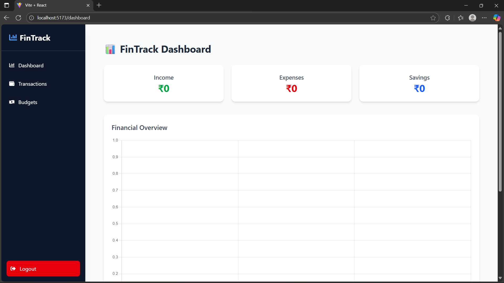

<h1 align="center">💸 FinTrack – Personal Finance Tracker With AI Assitance</h1>

  A full-stack personal finance management application that helps users track income, expenses, budgets, and savings with interactive dashboards, charts, and analytics. Designed to be secure, responsive, and user-friendly, FinTrack empowers users to stay in control of their money.

✨ Features:

✅ Authentication: Secure JWT login & registration.

✅ Transactions CRUD: Add, edit, delete, and view transactions.

✅ Budget Tracking: Set yearly spending limits by category.

✅ Financial Summary: Get a quick overview of your income, expenses, and savings.

✅ Interactive Dashboard: Visualize your finances with dynamic charts.

✅ Responsive UI: Seamless experience on any device, thanks to TailwindCSS.

✅ Secure: Robust token and cookie management for secure sessions.

🛠️ Tech Stack

Frontend:

⚡ React + Vite: Fast and modern UI development.

🎨 TailwindCSS: Utility-first CSS framework for rapid styling.

📈 Chart.js: For creating beautiful and interactive charts.

🧭 React Router: Declarative routing for the application.

Backend:

🚀 Node.js + Express: A fast, unopinionated, minimal web framework for Node.js.

🗄️ MongoDB + Mongoose: Flexible NoSQL database and an elegant object data modeling tool.

🔑 JWT Authentication: Securely handling user sessions.

🍪 Cookie & Token Handling: Secure management of authentication tokens.

📂 Project Structure:

FinTrack/
│── server/              # Backend
│   ├── config/          # DB connection
│   ├── controllers/     # Auth, Transactions, Budgets
│   ├── middleware/      # Auth middleware
│   ├── models/          # Schemas
│   ├── routes/          # API routes
│   └── index.js         # Entry point
│
│── fintrack-client/     # Frontend
│   ├── src/
│   │   ├── pages/       # Login, Register, Dashboard, Transactions
│   │   ├── components/  # Navbar, Sidebar, Layouts
│   │   ├── App.jsx
│   │   └── main.jsx
│   └── tailwind.config.js
│
└── README.md

🧪 API Endpoints

🔹 Auth

POST /api/auth/register → Register user

POST /api/auth/login → Login user

🔹 Transactions

POST /api/transactions → Add transaction

GET /api/transactions → Get all transactions

PUT /api/transactions/:id → Update transaction

DELETE /api/transactions/:id → Delete transaction

GET /api/transactions/summary → Income/Expense/Savings summary

🔹 Budgets

POST /api/budgets → Add budget

GET /api/budgets → Get all budgets

PUT /api/budgets/:id → Update budget

DELETE /api/budgets/:id → Delete budget

🚀 Getting Started:

Follow these steps to get the project up and running locally.

1️⃣ Clone the Repository
Bash

git clone https://github.com/Satwik290/fintrack.git
cd fintrack

2️⃣ Backend Setup
Bash

cd server
npm install
npm run dev
3️⃣ Frontend Setup
Bash

cd fintrack-client
npm install
npm run 

🔑 Environment Variables

Create a .env file in the /server directory and add the following:
PORT=5000

MONGO_URI=your_mongo_connection

JWT_SECRET=your_jwt_secret

CLIENT_URL=http://localhost:5173

📸 Screenshots:

Registration

Login

Dashboard

Transactions

📅 Roadmap

🚧 Upcoming Features:
Dark Mode
AI-Powered Insights (using Gemini API)
Notifications

🤝 Contributing
We welcome contributions! Please follow these steps:

1.Fork the repo 🍴

2.Create a new feature branch (git checkout -b feature/amazing-feature) 🌱

3.Commit your changes (git commit -m 'Add a new feature') ✨

4.Push to the branch (git push origin feature/amazing-feature) 🚀

5.Open a Pull Request!

📜 License

This project is licensed under the MIT License. See the LICENSE file for details.

© 2025 [Satwik Mohanty]

